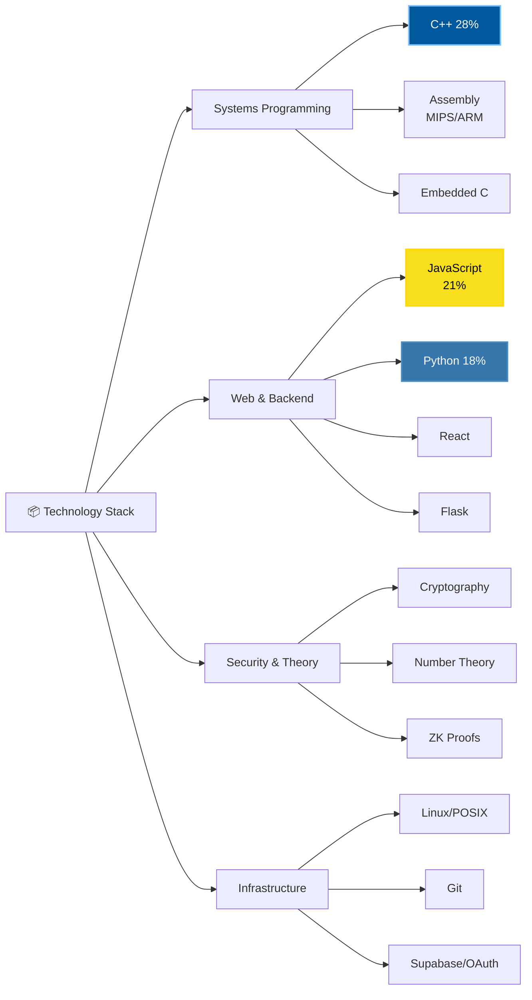
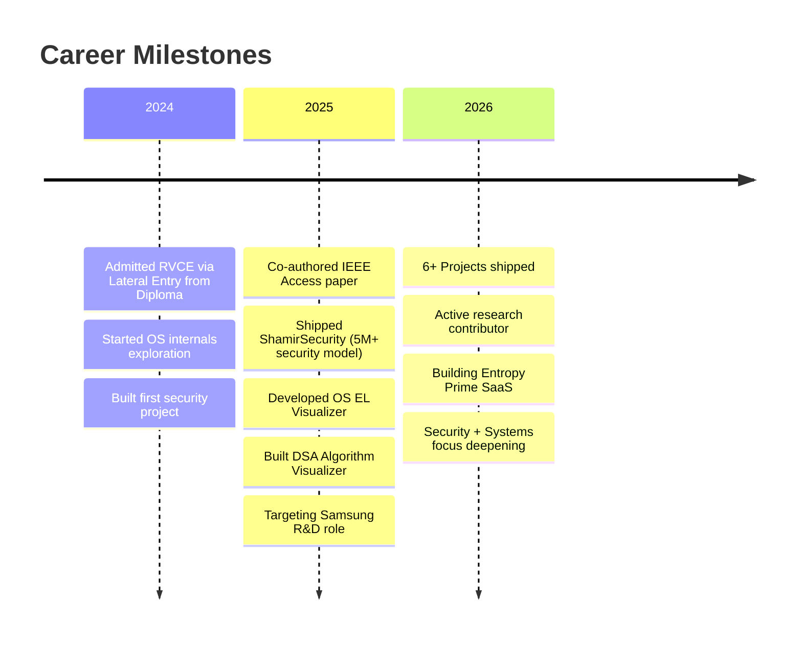
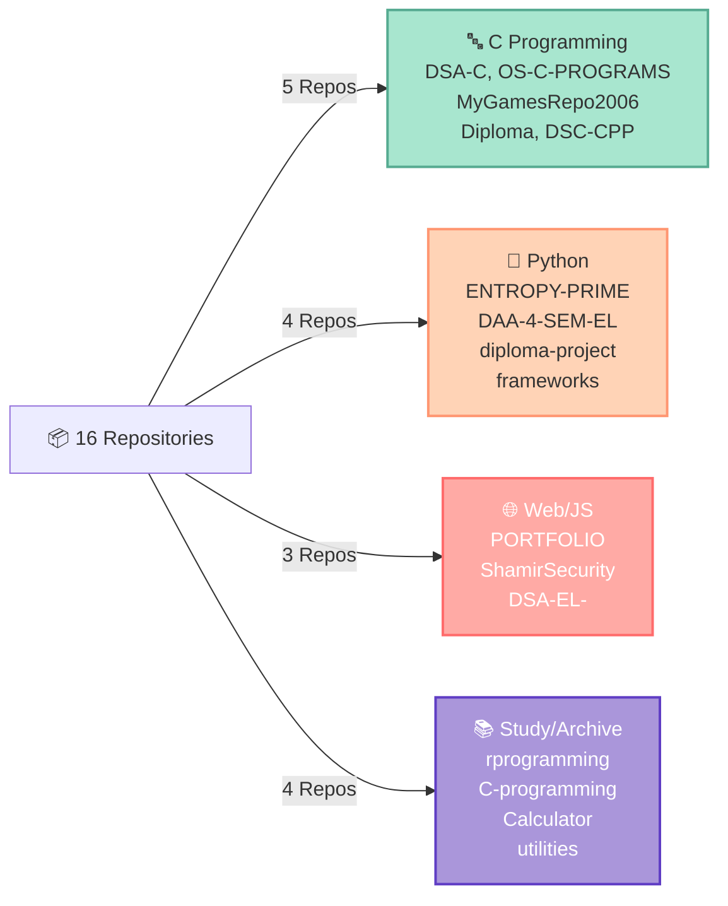
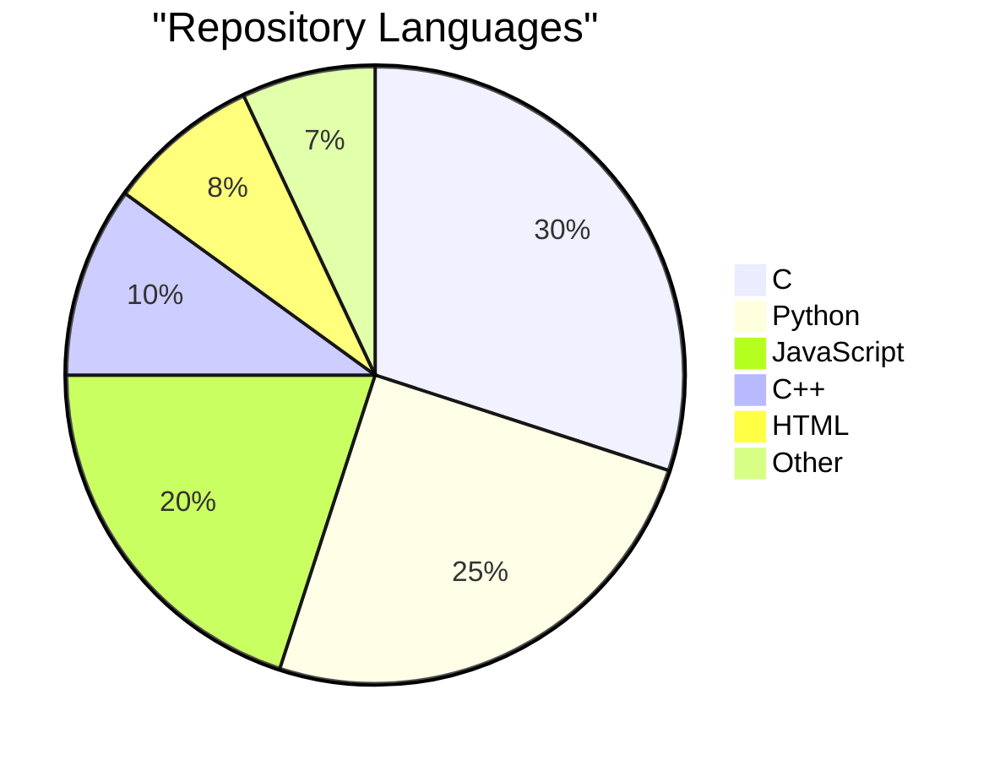
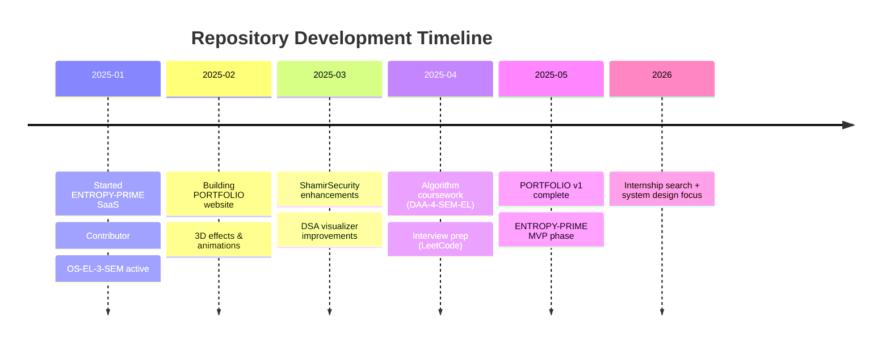
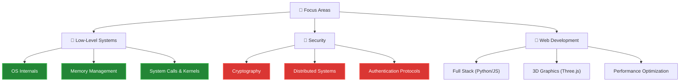

<div align="center">

<!-- Animated Typing Header -->


<br/>

<!-- Badges Row -->
[](https://devportfolio-livid-three.vercel.app/)
[](https://github.com/Parik-2006)
[](https://www.linkedin.com/in/parikshithbb)
[](https://leetcode.com/u/parik_2006/)
[](mailto:raptorparik2006@gmail.com)
[](https://instagram.com/parik_2006)

<br/>

> *"Turning complex logic into efficient code — from bare-metal to distributed systems."*

**16 Repositories | CSE Lateral Entry | RVCE '28 | Security + Systems Focus**

</div>

---

## 🧠 About Me

**Parikshith B Bilchode** | CSE Student · RVCE Bengaluru · Batch '28  
*Diploma → Lateral Entry → RVCE*

I build systems software and security tools. Currently exploring OS internals, cryptographic protocols, and full-stack development. When I'm not coding, I'm contributing to open-source or talking about low-level systems design.

📍 **Location:** Bengaluru, India  
🎓 **Education:** B.E. CSE (Lateral Entry from Diploma) | RVCE '28  
🏢 **Currently:** Building ENTROPY-PRIME SaaS | Contributing to 3+ active repos  
🎯 **Looking For:** Internships in systems engineering & security roles  

---

## ⚡ My Skillset

| Category | Skills |
|:---------|:--------|
| 💻 **Languages** | C, Python, JavaScript, C++, HTML5, CSS3 |
| 🖥️ **Systems** | Linux, POSIX APIs, OS concepts, Memory management |
| 🔐 **Security** | Cryptography basics, Authentication protocols, Distributed systems |
| 🌐 **Web** | React, Flask, Vite, Tailwind, Three.js, Responsive design |
| 🛠️ **Tools** | Git, GitHub, VS Code, Linux CLI, POSIX development |
| 📚 **Theory** | Data Structures (DSA), Algorithms, Number theory, OS design |

---

## 📂 My Projects

| Project | Description | Tech | Status |
|:--------|:------------|:-----|:-------|
| 🌐 **[PORTFOLIO](https://github.com/Parik-2006/PORTFOLIO)** | Developer portfolio with 3D effects, smooth animations, category-based filtering | Vite, Tailwind, Three.js | ✅ Live |
| 🔐 **[ShamirSecurity](https://github.com/Parik-2006/shamirsecurity)** | Distributed password management system | JavaScript | ⭐ 2 Stars |
| 🚀 **[ENTROPY-PRIME](https://github.com/Parik-2006/ENTROPY-PRIME)** | SaaS platform in development | Python, Flask | 🚧 Building |
| 🧮 **[OS-EL-3-SEM](https://github.com/Parik-2006/OS-EL-3-SEM)** | OS internals and kernel exploration visualizer | HTML, C, POSIX | ⭐ 3 Stars |
| 📊 **[DSA-EL-](https://github.com/Parik-2006/DSA-EL-)** | Algorithm visualization and DSA implementation | HTML, JavaScript | ⭐ 1 Star |
| 📈 **[DAA-4-SEM-EL](https://github.com/Parik-2006/DAA-4-SEM-EL)** | Design & Analysis of Algorithms coursework | Python | 📚 Academic |
| 🎓 **[diploma-project](https://github.com/Parik-2006/diploma-project)** | Diploma-level systems project | Python | ✅ Complete |
| 🎮 **[MyGamesRepo2006](https://github.com/Parik-2006/MyGamesRepo2006)** | Game development exploring memory management & real-time input | C | 🎯 Archive |
| 💾 **[DSA-C](https://github.com/Parik-2006/DSA-C)** | Data Structures & Algorithms implementations | C | 📚 Study |
| 🔧 **[OS-C-PROGRAMS](https://github.com/Parik-2006/OS-C-PROGRAMS)** | Operating System fundamentals and system calls | C | 📚 Study |
| 📖 **[C-programming](https://github.com/Parik-2006/C-programming)** | Core C programming fundamentals & concepts | C | 📚 Foundation |
| 📊 **[DSC-CPP](https://github.com/Parik-2006/DSC-CPP)** | Data Structures & Algorithms in C++ | C++ | 🔄 1 Fork |

---

## 📊 Repository Statistics

<div align="center">

| Metric | Value |
|:-------|:------|
| 🏗️ Total Repositories | 16 |
| ⭐ Total Stars | 7 |
| 🔀 Forks | 1 |
| 💾 Primary Languages | C, Python, JavaScript, C++ |
| 🎯 Active Projects | 3 (PORTFOLIO, ENTROPY-PRIME, ShamirSecurity) |

</div>

---

## 📈 GitHub Activity & Metrics

<div align="center">


&nbsp;


<br/><br/>


<br/><br/>


</div>

---

## 🔧 Technology Stack Distribution



---

## 🏆 Key Achievements



---

## ⚡ Tech Stack by Repository Contribution



---

## 🏆 Top Starred Projects

```
🌟 OS-EL-3-SEM .............. ⭐⭐⭐ (3 stars)
    → Operating System internals & kernel visualization
    
🌟 ShamirSecurity ........... ⭐⭐ (2 stars)
    → Distributed password management system
    
🌟 DSA-EL- ................. ⭐ (1 star)
    → Algorithm visualization & DSA implementations
```

---

## 📉 Language Distribution



---

## 🎯 Current Focus



---

## 📈 GitHub Contributions

<div align="center">


&nbsp;


<br/><br/>


<br/><br/>


</div>

---

## 🛠️ Languages & Tools

<div align="center">


</div>

---

## 💡 What I'm Learning



---

## � Contribution Chart

<div align="center">


</div>

---

## 🌟 Highlighted Achievements

```
🔧 PORTFOLIO Website
   ├─ Vite + Tailwind + Three.js
   ├─ Smooth 3D animations & transitions
   └─ Live: devportfolio-livid-three.vercel.app

💻 OS-EL-3-SEM (3 ⭐)
   ├─ Operating System visualization
   ├─ Educational resource for kernel concepts
   └─ 3 stars on GitHub

🔐 ShamirSecurity (2 ⭐)
   ├─ Distributed password management
   ├─ Full-stack JavaScript implementation
   └─ 2 stars on GitHub

📊 DSA-EL- (1 ⭐)
   ├─ Algorithm visualization tool
   ├─ Interactive learning resource
   └─ 1 star on GitHub
```

---

## 📞 Let's Connect

<div align="center">

**Open to:** 
- 🤝 Collaborations on interesting projects
- 💼 Internships & full-time opportunities  
- 📚 Technical discussions on systems & security
- 🚀 Building cool stuff together

<br/>

**[📧 Email](mailto:raptorparik2006@gmail.com) · [🔗 LinkedIn](https://www.linkedin.com/in/parikshithbb) · [🌐 Portfolio](https://devportfolio-livid-three.vercel.app/) · [💻 GitHub](https://github.com/Parik-2006) · [📱 Instagram](https://instagram.com/parik_2006)**

<br/>

**RVCE '28 · Bengaluru, India · Diploma → CSE Lateral Entry**


</div>

---

<div align="center">

**Built with 🔥 | Last Updated: April 2026**

</div>
