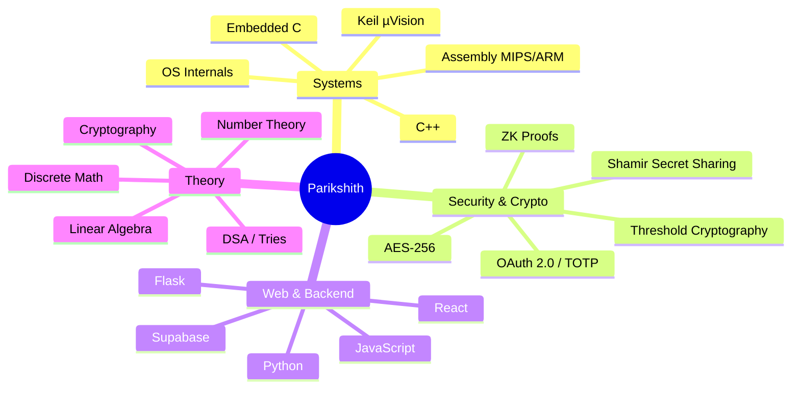
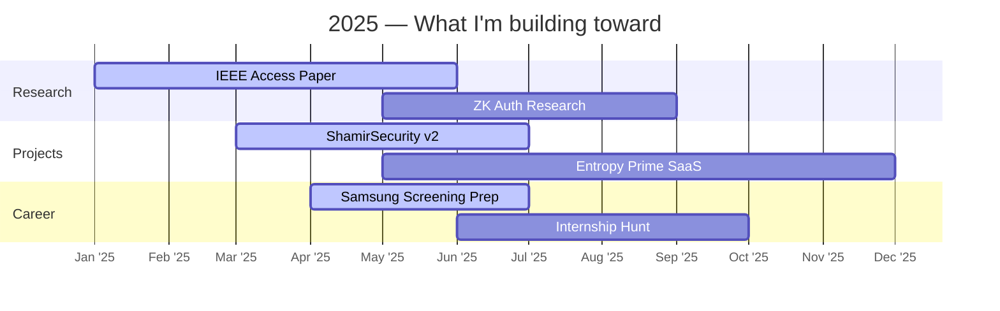

<div align="center">

<!-- Animated Typing Header -->


<br/>

<!-- Badges Row -->
[](https://devportfolio-livid-three.vercel.app/)
[](https://www.linkedin.com/in/parikshithbb)
[](https://leetcode.com/u/parik_2006/)
[](mailto:raptorparik2006@gmail.com)

<br/>

> *"Turning complex logic into efficient code — from bare-metal to distributed systems."*

</div>

---

## 🧠 About Me

```
┌─────────────────────────────────────────────────────────┐
│  Parikshith B Bilchode                                  │
│  B.E. CSE (Lateral Entry) · RVCE Bengaluru · Batch '28  │
│                                                         │
│  🔬  Co-authoring IEEE Access paper on Multi-Cloud Vault │
│  🔐  Building ShamirSecurity — distributed PWD manager  │
│  ⚙️   Diving deep into OS internals & scheduling algos  │
│  🎯  Targeting Samsung R&D + systems/security roles     │
│                                                         │
│  Background: Diploma → CSE Lateral Entry → RVCE         │
│  Edge: Hands-on embedded roots before CS theory         │
└─────────────────────────────────────────────────────────┘
```

---

## ⚡ Tech Stack & Expertise



---

## 📂 Featured Projects

| Project | Description | Stack | Status |
|:--------|:------------|:------|:-------|
| 🔐 **[ShamirSecurity](https://shamirsecurity-1-aclh.onrender.com)** | Distributed password vault — SSS + AES-256 + Google OAuth + TOTP | React, Flask, Python | 🟢 Active |
| 📄 **Multi-Cloud Vault** | IEEE Access paper on threshold cryptography across cloud providers | Research, Cryptography | 📝 In Review |
| 🧮 **[OS EL — Kernel Explorations](https://osel2025.vercel.app/)** | OS internals: scheduling, memory, syscalls | C, POSIX | 🟢 Live |
| 📊 **[DSA Algorithm Visualizer](https://dsa-el-2.onrender.com/)** | Interactive viz of sorting, graphs, DP | JavaScript | 🟢 Live |
| 🔮 **Zero-Knowledge Auth** | ZK-proof based auth flows — privacy without secrets | ZK Proofs, Number Theory | 🔬 Research |
| 🤖 **Entropy Prime** | SaaS project — currently in development | TBD | 🚧 Building |

---

## 📊 Contribution Breakdown

<div align="center">

</div>

> Pure builder mode — 99% commits, ship fast, iterate faster.

---

## 📈 GitHub Activity

<div align="center">


&nbsp;


<br/><br/>


<br/><br/>


</div>

---

## 🛠️ Tools & Languages

<div align="center">


</div>

---

## 🎯 Current Focus



---

<div align="center">

**RVCE '28 · Bengaluru, India**

*Open to research collaborations, internships, and systems/security conversations.*


</div>
